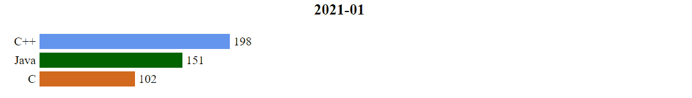

# Bar Chart Race in HTML5

Make animated bar chart races in pure HTML5. None extra js libaraies required.



## Demo Link

[https://jennal.com/bar-chart-race](https://jennal.com/bar-chart-race)

## Data Format

```
var data = {
    "titles": ["2021-01", "2021-02", "2021-03", "2021-04", "2021-05", "2021-06", "2021-07", "2021-08", "2021-09", "2021-10", "2021-11", "2021-12"],
    "items": [
        {
            "name": "C",
            "color": "chocolate",
            "values": [100, 200, 100, 200, 100, 200, 100, 200, 100, 200, 100, 200]
        },
        {
            "name": "C++",
            "color": "cornflowerblue",
            "values": [200, 100, 200, 100, 200, 100, 200, 100, 200, 100, 200, 100]
        },
        {
            "name": "Java",
            "color": "darkgreen",
            "values": [150, 200, 300, 400, 300, 200, 100, 200, 300, 400, 300, 200]
        }
    ]
};
```

## License

MIT-licensed

Enjoy!